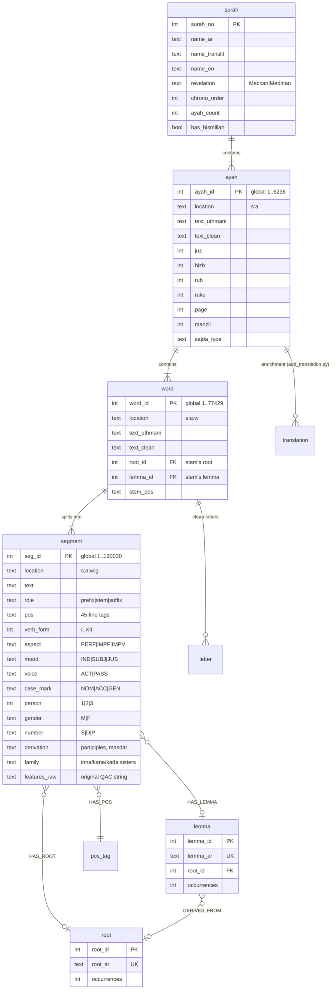

# QKG Architecture

The Quran Knowledge Graph is layered so that each stage has one job and one
owner, and enrichment never requires redesign.

```
┌─────────────────────────────────────────────────────────────────────┐
│ SOURCES (data/)                                                     │
│  Quranic Arabic Corpus v0.4 morphology · Tanzil metadata XML        │
│  Tanzil Uthmani text v1.1 · simple clean text                       │
└──────────────────────────────┬──────────────────────────────────────┘
                               │  build_qkg.py  (Python stdlib, deterministic,
                               │  self-validating; ~10 s CPU)
┌──────────────────────────────▼──────────────────────────────────────┐
│ quran-kg.db — CANONICAL RELATIONAL LAYER (source of truth)          │
│  research interface: full SQL, views, statistics, graph exports     │
│  enrichment layers attach by stable ID:                             │
│    add_translation.py      → translation(ayah_id, lang, …)          │
│    js/scripts/embed-ayahs.mjs (Gemini) → ayah_embedding(ayah_id, …) │
└──────────────────────────────┬──────────────────────────────────────┘
                               │  js/scripts/convert-to-app-db.mjs (Node)
┌──────────────────────────────▼──────────────────────────────────────┐
│ quran-app.db — APPLICATION LAYER (monlite)                          │
│  surahs · ayahs (FTS + translations) · words (morphology embedded)  │
│  roots (lemmas + locations) · rootEdges (co-occurrence) · meta      │
└───────┬──────────────────────┬──────────────────────────────────────┘
        │                      │
  quran-kg npm pkg      Quran Studio (React + @monlite/wasm, browser)
  (node:sqlite)         reader · morphology · roots · network ·
                        search · collections · dashboard — no server
```

## Entity model (quran-kg.db)



Everything is addressable by a stable `location` string (`2:255:5:2` = surah
2, ayah 255, word 5, segment 2), so any future layer — tafsir, qira'at, audio
timings, embeddings, hadith cross-references — attaches by ID without schema
changes. The `translation` table (created by `add_translation.py`) is the
first such enrichment and the template for the rest.

## Design decisions

1. **Relational core, document app layer.** Research questions are joins
   ("verbs of root X in Medinan surahs in the jussive"); SQL owns those. App
   screens are documents ("this ayah with its words and morphology"); monlite
   owns those. Converting one way (relational → documents) is cheap and
   deterministic; the reverse is not.
2. **Provenance as data.** Every layer records source/version/license in the
   `provenance` table. Annotations are never merged destructively — a future
   second analyzer would sit alongside QAC, not overwrite it.
3. **Raw features kept.** `segment.features_raw` preserves the exact QAC
   feature string, so decoding bugs are always recoverable and alternative
   decoders can be validated against the original.
4. **Deterministic builds.** `build_qkg.py` has no dependencies beyond the
   Python stdlib and produces a byte-identical database from the same
   sources; validation runs on every build.
5. **The browser is a first-class runtime.** The monlite file format is
   identical across Node/Python/WASM, so the explorer is a static site — no
   API server exists, and none is needed until multi-user features appear.

## Graph exports

`export_graph.py` derives network views (root co-occurrence weighted by
shared ayahs; root→lemma derivation) as CSVs for Gephi/Cytoscape/networkx
plus a Cypher script for Neo4j. These are *projections* of the relational
core — regenerate at will, never hand-edit.

## Known counting conventions

- Ayah count 6,236 (Kufan numbering, basmala unnumbered except 1:1).
- Word = whitespace token of the Uthmani text (QAC convention), so clitics
  (و، ف، ب، ل...) are *segments within* a word, not words.
- Letter counts derive from the clean (diacritic-free) text.
- Revelation types and chronological order follow Tanzil's metadata.
